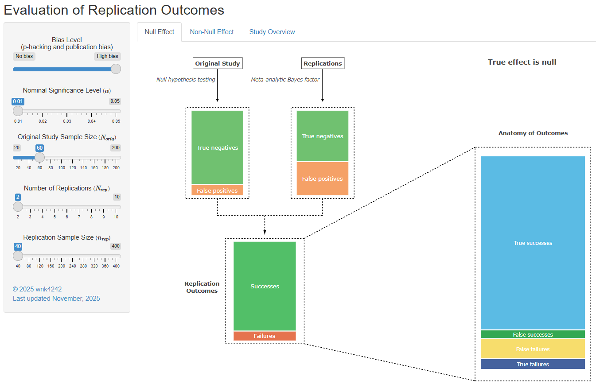

# Seeing Beyond Replication Success: A Framework for Evaluating Multi-Lab Replication Outcomes Using Meta-Analytic Bayes Factors

This repository accompanies the manuscript entitled *“Seeing Beyond Replication Success: A Framework for Evaluating Multi-Lab Replication Outcomes Using Meta-Analytic Bayes Factors.”*  
It contains the R code, processed data, and supplementary materials required to reproduce the analyses and visualizations presented in the paper.
Readers may find it helpful to explore our accompanying [Shiny app](https://quantpsych.shinyapps.io/BJMSP_AnatomyofReplicationSuccess/), an interactive diagram that visualizes the main findings of this study, while reading the manuscript.

  

---

## Repository Contents

### Supplementary Materials
This folder includes materials referenced in the manuscript:

- **Appendix A – Figures:** Contains all figures presented in the paper, as well as the complete set of ROC curve graphs that were not shown in the manuscript.  
- **Appendix B – Tables:** Contains all summary tables reporting key simulation results and performance comparisons across meta-analytic Bayes factor (MABF) methods.  
- **Appendix C – Data Generation Process:** Provides a detailed description of the parameter settings used to generate study-level effect sizes and participant-level data in the two-phase simulation design.
- **Appendix D - R functions for _p_-hacking:** Describes the hierachical structure and purposes of the R functions used to simulate the effects of the _p_-hacking mechanism.
---

### R Code
The repository provides original R code used for simulation, data analysis, and visualization.

- The R code in the `original_code` folder reproduces the full simulation workflow.  
  Due to computational demands, R code for **Steps 1.0-3.5** require high-performance computing (HPC) resources and cannot be executed on a standard computer.  
- Fully processed simulation datasets are provided for readers to reproduce the main plots in the manuscript, including ROC curves and stacked bar charts.  
  The demonstration scripts for these analyses are located in the `demo code` folder.

---

### Simulation and Analysis Workflow

**Step 1.0–1.2: Data Generation**  
- Generate original study results.  
- Generate replication study results.  
- Synthesize replication data using meta-analytic Bayes factor (MABF) and random-effects meta-analysis (REMA) methods.  

**Step 2: Data Combination**  
- Combine individual simulation outputs into a single dataset for each of the MABF method as well as the REMA method for subsequent analysis.  

**Step 3.0–3.5: Data Analysis**  
- Analyze original study results.  
- Compute evaluation metrics for ROC curves and stacked bar plots.  

**Step 4: Data Visualization**  
- Visualize original study results using bar plots, histograms, and heatmaps.  
- Visualize replication study results using ROC curves and stacked bar plots.  

**Step 5.0-5.1: AUC Calculation and Shiny App Development**  
- Calculate Area-Under-Curve (AUC) for MABF and REMA methods.
- Develop Shiny dashboards for interactive, point-and-click data visualization.  
- Generate APA 7th edition–style, publication-ready tables through Shiny interfaces.

     
