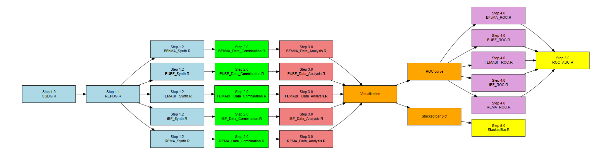

# Seeing Beyond Replication Success: A Framework for Evaluating Multi-Lab Replication Outcomes Using Meta-Analytic Bayes Factors

This repository accompanies the manuscript entitled *“Seeing Beyond Replication Success: A Framework for Evaluating Multi-Lab Replication Outcomes Using Meta-Analytic Bayes Factors.”* It contains the R code, processed data, and supplementary materials necessary to reproduce the analyses presented in the paper.

---

## Repository Contents

### Supplementary Materials
This folder includes materials referenced in the manuscript:

- **Appendix A – Figures:** Contains all figures presented in the paper, as well as the complete set of ROC curve graphs that were not shown in the manuscript. 
- **Appendix B – Tables:** Contains all summary tables reporting key simulation results and performance comparisons across meta-analytic Bayes factor methods.  
- **Appendix C – Data generation process:** A detailed description of the parameter settings used for generating study-level effect sizes and participant-level data in the two-phase simulation design.

---
### R code
We provide original R code for the simulation and analysis in the `original code` folder.  
The R code in the `code for demonstration` folder demonstrates simulation and data analysis procedures. Due to computational requirements, code from Steps 1.0 and 4.0 require high-performance computing resources. Fully processed simulation datasets are available for readers to reproduce results using the `Step 4.1 ROC_AUC.R` script.

**Step 1: Data Generation**
-  `Step 1.0 OGDG.R`: Generate original study results.
-  `Step 1.1 REPDG.R`: Generate replication study results.
- Synthesize replication data using Bayes factor methods:
  - `Step 1.2 BFbMA_SYNTH.R`: Applies the Bayes factor based on meta-analysis (BFbMA)  method to synthesize replication study data.
  - `Step 1.2 EUBF_SYNTH.R`: Applies the evidence updating Bayes factor (EUBF) method to synthesize replication study data.
  - `Step 1.2 FEMABF_SYNTH.R`: Applies the fixed-effect meta-analytic Bayes factor (FEMABF)  method to synthesize replication study data.
  - `Step 1.2 iBF_SYNTH.R`: Applies the inclusion Bayes factor (iBF) method to synthesize replication study data.
  - `Step 1.2 REMA_SYNTH.R`: Applies the random-effect meta-analysis (REMA) method to synthesize replication study data.

**Step 2: Data Combination**
- Combine synthesized replication data:
  - `Step 2.0 BFbMA_Data_Combination.R`: Combine replication data synthesized by the BFbMA method into one single dataset for further analysis.
  - `Step 2.0 EUBF_Data_Combination.R`: Combine replication data synthesized by the EUBF method into one single dataset for further analysis.
  - `Step 2.0 FEMABF_Data_Combination.R`: Combine replication data synthesized by the FEMABF method into one single dataset for further analysis.
  - `Step 2.0 iBF_Data_Combination.R`: Combine replication data synthesized by the iBF method into one single dataset for further analysis.
  - `Step 2.0 REMA_Data_Combination.R`: Combine replication data synthesized by the REMA method into one single dataset for further analysis.

**Step 3: Data Analysis**
- Compute evaluation metrics (true/false positive and negative rates):
  - `Step 3.0 BFbMA_Data_Analysis.R`: Computes evaluation metrics (e.g., true/false positive rates, true/false negative rates) for the BFbMA method. 
  - `Step 3.0 EUBF_Data_Analysis.R`: Computes evaluation metrics for the EUBF method.
  - `Step 3.0 FEMABF_Data_Analysis.R`: Computes evaluation metrics for the FEMABF method. 
  - `Step 3.0 iBF_Data_Analysis.R`: Computes evaluation metrics for the iBF method. 
  - `Step 3.0 REMA_Data_Analysis.R`: Computes evaluation metrics for the REMA method

**Step 4: ROC Curve Data Processing**
- Prepare data for ROC curves:
  - `Step 4.0 BFbMA_ROC.R`: Prepares data for ROC curve generation for the BFbMA method.
  - `Step 4.0 EUBF_ROC.R`: Prepares data for ROC curve generation for the EUBF method.
  - `Step 4.0 FEMABF_ROC.R`: Prepares data for ROC curve generation for the FEMABF method.
  - `Step 4.0 iBF_ROC.R`: Prepares data for ROC curve generation for the iBF method.
  - `Step 4.0 REMA_ROC.R`: Prepares data for ROC curve generation for the REMA method.

**Step 5: Data Visualization**
- Use ggplot2 to create visualizations.
  - `Step 5.0 ROC_AUC.R`: Generates ROC curves and compute AUC for the MABF methods and the REMA method.
  - `Step 5.0 StackedBar.R`: Generate stacked bar plots for the MABF methods.

### Workflow Diagram

An R script workflow diagram is included to illustrate the data generation and analysis process.

     
