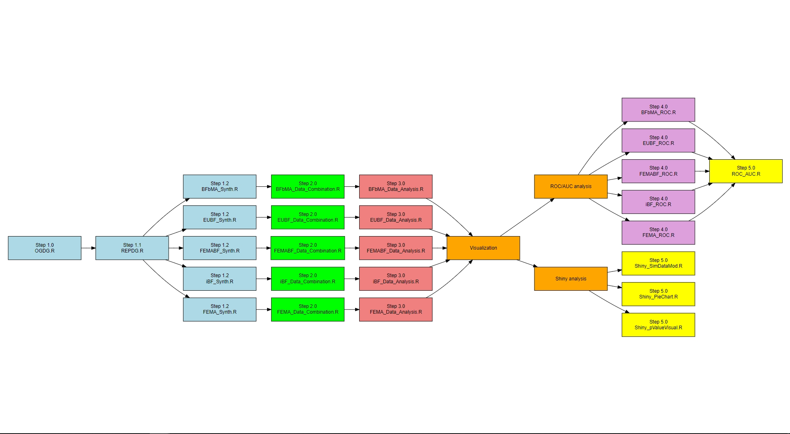

This is the repository for the manuscript, entitled "Seeing Beyond Replication Success: A Framework for Evaluating Multi-Lab Replication Outcomes Using Meta-Analytic Bayes Factors." This repository contains the R code and supplementary materials for readers. 
### Supplementary materials
- Appendix A: Figures.
- Appendix B: Tables.
- Appendix C: Data generation process.

### R code
We provide original R code for the simulation and analysis in the `original code` folder.  
The R code in the `code for demonstration` folder demonstrates simulation and data analysis procedures. Due to computational requirements, code from Steps 1.0 and 4.0 require high-performance computing resources. Fully processed simulation datasets are available for readers to reproduce results using the `Step 4.1 ROC_AUC.R` script.

**Step 1: Data Generation**
- Generate original (`Step 1.0 OGDG.R`) and replication study results (`Step 1.1 REPDG.R`).
- Synthesize replication data using Bayes factor methods:
  - `Step 1.2 BFbMA_SYNTH.R`
  - `Step 1.2 EUBF_SYNTH.R`
  - `Step 1.2 FEMABF_SYNTH.R`
  - `Step 1.2 iBF_SYNTH.R`
  - `Step 1.2 REMA_SYNTH.R`

**Step 2: Data Combination**
- Combine synthesized replication data:
  - `Step 2.0 BFbMA_Data_Combination.R`
  - `Step 2.0 EUBF_Data_Combination.R`
  - `Step 2.0 FEMABF_Data_Combination.R`
  - `Step 2.0 iBF_Data_Combination.R`
  - `Step 2.0 REMA_Data_Combination.R`

**Step 3: Data Analysis**
- Compute evaluation metrics (true/false positive and negative rates):
  - `Step 3.0 BFbMA_Data_Analysis.R`
  - `Step 3.0 EUBF_Data_Analysis.R`
  - `Step 3.0 FEMABF_Data_Analysis.R`
  - `Step 3.0 iBF_Data_Analysis.R`
  - `Step 3.0 REMA_Data_Analysis.R`

**Step 4: ROC Curve Data Processing**
- Prepare data for ROC curves:
  - `Step 4.0 BFbMA_ROC.R`
  - `Step 4.0 EUBF_ROC.R`
  - `Step 4.0 FEMABF_ROC.R`
  - `Step 4.0 iBF_ROC.R`
  - `Step 4.0 REMA_ROC.R`

**Step 5: Shiny App Development**
- Use Shiny to create interactive dashboards for data visualization
  - `Step 5.0 Shiny_ROC_AUC.R`
  - `Step 5.0 Shiny_StackedBar.R`

### Workflow Diagram

An R script workflow diagram is included to illustrate the data generation and analysis process.

     
