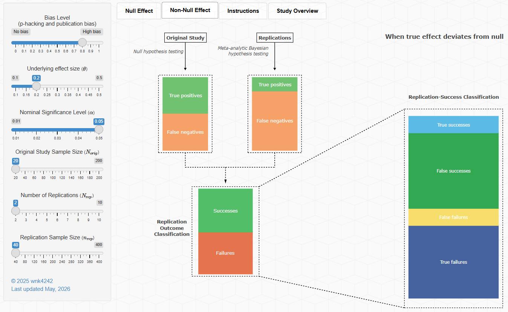

# A Framework for Evaluating Replication-Success Metrics

This repository accompanies the manuscript entitled *“A Framework for Evaluating Replication-Success Metrics”*  
It contains the R code required to reproduce the analyses and visualizations presented in the paper.
Readers may find it helpful to explore our companion [Shiny app](https://quantpsych.shinyapps.io/BJMSP_AnatomyofReplicationSuccess/), an interactive diagram that visualizes the main findings of this study, while reading the manuscript.

  

---

### Simulation and Analysis Workflow

**Step 1.0–1.2: Data Generation**  
- Generate original study results.  
- Generate replication study results.  
- Synthesize replication data using meta-analytic Bayes factor (MABF) and random-effects meta-analysis (REMA) methods.  

**Step 2.0: Data Combination**  
- Combine individual simulation outputs into a single dataset for each of the MABF method as well as the REMA method for subsequent analysis.  

**Step 3.0–3.5: Data Analysis**  
- Analyze original study results.  
- Compute evaluation metrics for ROC curves and stacked bar plots.  

**Step 4.0: Data Visualization**  
- Visualize original study results using bar plots, histograms, and heatmaps.  
- Visualize replication study results using ROC-like curves and stacked bar plots.      
